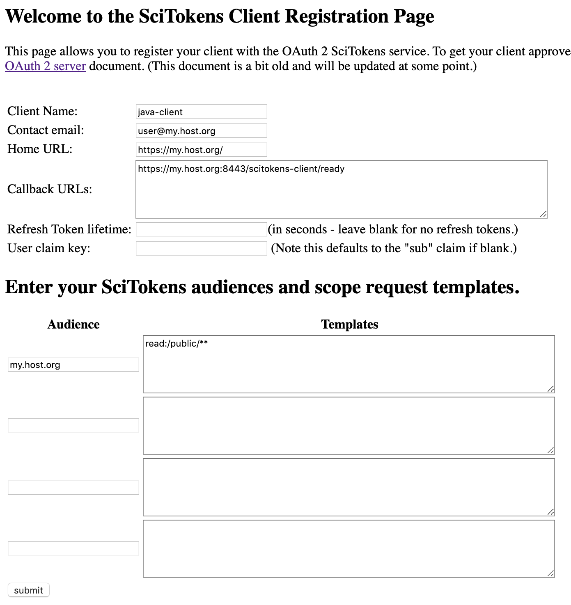

# Scitokens Server Docker Image

This repository contains a Docker image to install the [SciTokens Java
Server and Client](https://github.com/scitokens/scitokens-java) and run them
from an Apache Tomcat server with basic authentication.

The image is configured with a set of `--build-args` to `docker build`. The
SciTokens server is always installed and the SciTokens client can be
optionally installed as well.

## Prerequisites

The Dockerfile expects that an X509 host certificate and key pair exists in
this directory with the names `hostcert.pem` and `hostkey.pem`. Obtain these
files and add them to this directory before building the Docker image. The
[.gitignore](https://github.com/scitokens/docker-scitokens-java/blob/master/.gitignore) 
file will prevent these files being added to the repository.

## Building the Docker image

The build arguments for the Docker images are:

| Argument | Meaning | Default |
| -------- | ------- | ------- |
| `TOMCAT_ADMIN_USERNAME` | Username for the Tomcat Admin account | admin |
| `TOMCAT_ADMIN_PASSWORD` | Password for the Tomcat Admin account | password |
| `TOMCAT_ADMIN_IP` | Regular expression for [access to the Tomcat manager](https://tomcat.apache.org/tomcat-8.5-doc/manager-howto.html#Configuring_Manager_Application_Access) | 127.0.0.1 |
| `SCITOKENS_SERVER_ADDRESS` | The address and port used by Tomcat | 127.0.0.1:8443 |
| `INSTALL_SCITOKENS_CLIENT` | If `true` also install the SciTokens client | `false` |

Using an appropriate set of build arguments, 

```sh
docker build \
  --build-arg TOMCAT_ADMIN_USERNAME=admin \
  --build-arg TOMCAT_ADMIN_PASSWORD=password \
  --build-arg TOMCAT_ADMIN_IP=127.0.0.1 \
  --build-arg SCITOKENS_SERVER_ADDRESS=127.0.0.1:8443
  --rm -t scitokens/c7-token-server .
```

To also install the client, add `--build-arg INSTALL_SCITOKENS_CLIENT=true`

## Starting the Docker Image

Edit the file `docker-compose.yml` and change the default `hostname` and
`domainname` (currently localhost.localdomain) to appropriate values for the
machine that you are using, then start the docker container with

```sh
docker-compose up --detach
```

## Registering a client

If your `SCITOKENS_SERVER_ADDRESS` is `my.host.org:8443` then the SciTokens server
will be available to register clients at
`https://my.host.org:8443/scitokens-server/register`

Go to the appropriate URL and register a client. An example for registering
the Java client is shown below.



## Approving a client

Once a client has been registered, it needs to be approved. This can be done
by running
```sh
docker exec -it scitokens-docker_scitokens-tomcat_1 /opt/scitokens-server/bin/scitokens-cli
```
which launches the command line interface. Documentation for the CLI is
available in the [OA4MP CLI documentation](http://grid.ncsa.illinois.edu/myproxy/oauth/server/manuals/cli.xhtml).

First issue the `use clients` command,
followed by `ls` to list available clients. Clients that are not approved are 
flagged with `(N)` in the second column. To approve a client you need the 
`client_id_string` which is in the third column (before the client name).

Next run `approve /client_id_string` (note the `/` at the start of 
the `client_id_string` which is not printed by `ls`). Provide an 
approver name (which is a free-form string), set the client to approved,
and save.

An example session is shown below.
```
*************************************************************
* OA4MP2 OAuth 2/OIDC CLI (Command Line Interpreter)        *
* Version 4.2-SNAPSHOT                                      *
* By Jeff Gaynor  NCSA                                      *
*  (National Center for Supercomputing Applications)        *
*                                                           *
* type 'help' for a list of commands                        *
*      'exit' or 'quit' to end this session.                *
*************************************************************
OAuth 2 for MyProxy, version 4.2-SNAPSHOT startup on Wed Sep 25 18:11:48 UTC 2019
Store contains 1 entries.
cli>use clients
Store contains 1 entries.
  clients >ls
  0. (N) myproxy:oa4mp,2012:/client_id/193465d162e66dbfd8fffd79fb903e9e (sugwg-scitokens-cond...) created on 2019-09-25T18:09:01.393Z
  clients >approve /myproxy:oa4mp,2012:/client_id/193465d162e66dbfd8fffd79fb903e9e
    approver[(null)]:duncan
    set approved?[n]:y
    save this approval record [y/n]?y
    approval saved
  clients >exit
exiting ...
cli>exit
exiting ...
```

## Configuring the Java Client

If you installed the SciTokens Java client, then it will be available at 
`https://my.host.org:8443/scitokens-client`. Register the client with the server
using the callback URL `https://my.host.org:8443/scitokens-client/ready`.

Then edit the client's configuration start a login shell on the Docker container with
```sh
docker exec -it scitokens-docker_scitokens-tomcat_1 /bin/bash -l
```
Using `vi`, edit the file
`/opt/scitokens-client/config/client-config.xml` and set the `CLIENT_IDENTIFIER` and
`CLIENT_SECRET` to the values returned when you registered the client with the server.

Once this has file has been edited, you need to restart tomcat with
```sh
systemctl restart tomcat
```
and then the client can be used to obtain a token from the server.

